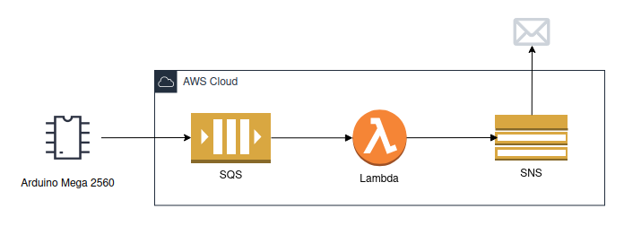

# Monitor de nível de água com Arduino e integração com a AWS

## Sobre o projeto
O projeto consiste em um **monitor de nível de água** utilizando uma **placa Arduíno** e com uma **integração com a nuvem AWS**.<br>
Para isso, foi utilizado um **sensor ultrassônico** para calcular o nível da água em um intervalo de tempo. As métricas coletadas são passadas para uma **aplicação em Python** que envia os dados para o serviços de **fila de mensageria SQS na AWS**.<br>
O tratamento dos dados recebidos é de responsabilidade de uma **função Lambda**, a qual será inscrita no tópico da fila para receber as métricas coletadas. A função **envia um e-mail através de um tópico SNS** caso uma **alteração seja identificada** no nível da água, e também o dado coletado vai ser registrado em uma **tabela do DynamoDB para registros históricos**.

## Materiais utilizados
* Breadboard
* Arduino Mega 2560
* Sensor ultrassônico 
* Cabo USB 2.0 B para conexão do Arduino

## Arquitetura AWS


### Criação e configuração de recursos AWS
1. Criada a **fila SQS** do tipo Standard para **envio das métricas** coletadas pelo sensor relativos ao nível da água
2. Criada o **tópico SNS** e a subscription de e-mail que vai receber **notificações sobre alterações** nas medidas da água
3. Criada a **tabela do DynamoDB** para receber os **registros das coletas**, com a chave primária sendo a data e hora em que foi realizada
4. Criada a **função Lambda** e adicionada as seguintes permissões na política da sua role de execução:
```
"sqs:DeleteMessage",
"sqs:Get*",
"sqs:ReceiveMessage",
"sns:Publish",
"dynamodb:BatchWriteItem",
"dynamodb:PutItem"
```
5. Adicionada a **fila SQS** para servir como **trigger** da função Lambda criada
6. Criado um **usuário** com as permissões necessárias para **enviar mensagens ao SQS**

## Referências
* [Como conectar o Sensor Ultrassônico HC-SR04 ao Arduino](https://www.makerhero.com/blog/sensor-ultrassonico-hc-sr04-ao-arduino/)
* [Como Conectar o Arduino com o Python](https://blog.eletrogate.com/como-conectar-o-arduino-com-o-python/)
* [Integrating Lambda to send and receive messages from SQS and SNS: Part 1](https://medium.com/@aaloktrivedi/integrating-lambda-to-send-and-receive-messages-from-sqs-and-sns-part-1-5b359f0f1678)
* [Integrating Lambda to send and receive messages from SQS and SNS: Part 2](https://medium.com/@aaloktrivedi/integrating-lambda-to-send-and-receive-messages-from-sqs-and-sns-part-2-6595133dd1a3)